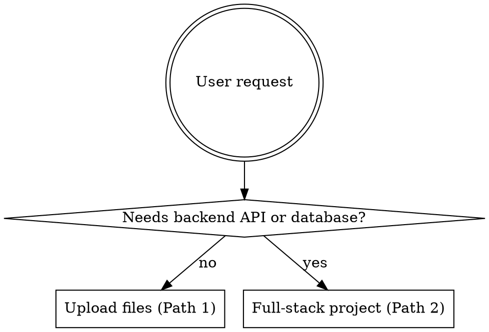
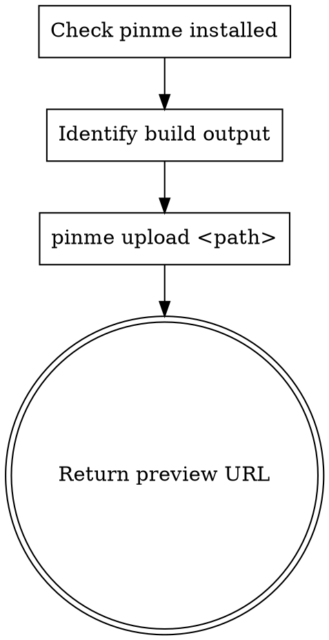
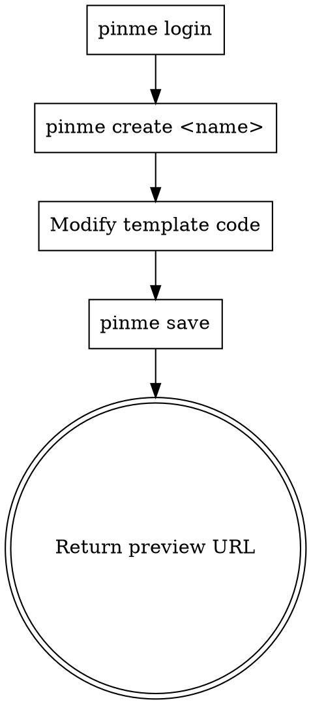

# PinMe

Zero-config deployment tool: upload static files to IPFS, or create and deploy full-stack web projects (React+Vite + Cloudflare Worker + D1 database). Worker also supports sending emails via Pinme platform API.

## When to Use



## Path 1: Upload Files / Static Sites

> No login required.



**1. Check installation:**
```bash
pinme --version
# If missing: npm install -g pinme
```

**2. Identify upload target** (priority order):
1. `dist/` — Vite / Vue / React
2. `build/` — Create React App
3. `out/` — Next.js static export
4. `public/` — Pure static

**3. Upload:**
```bash
pinme upload <path>
pinme upload ./dist --domain my-site  # Optional: bind subdomain (VIP required)
```

**4. Return** the preview URL (`https://pinme.eth.limo/#/preview/*`) to the user.

### Common examples

```bash
pinme upload ./document.pdf          # Single file
pinme upload ./my-folder             # Folder
pinme upload dist                    # Vite/Vue build output
pinme upload build                   # CRA build output
pinme upload out                     # Next.js static export
pinme upload ./dist --domain my-site # Bind Pinme subdomain (VIP required)
pinme import ./my-archive.car        # Import CAR file
```

### Do NOT upload
- `node_modules/`, `.env`, `.git/`, `src/`
- Upload build artifacts only, not source code

---

## Path 2: Full-Stack Project

> Login required. Uses React+Vite frontend + Cloudflare Worker backend + D1 SQLite database.



### Architecture

| Layer | Tech | Deploy target |
|-------|------|---------------|
| Frontend | React + Vite (`frontend/`) | IPFS |
| Backend | Cloudflare Worker (`backend/src/worker.ts`) | `{name}.pinme.pro` |
| Database | D1 SQLite (`db/*.sql`) | Cloudflare D1 |

### Core commands

```bash
pinme login                  # Login (once)
pinme create <dirName>       # Clone template and create project (auto-fills API URL)
pinme save                   # First deploy / full update (frontend + backend + database, one command)
pinme update-worker          # Update backend only (when only backend/src/worker.ts changed)
pinme update-web             # Update frontend only (when only frontend/src/ changed)
pinme update-db              # Run SQL migrations only (when only db/ changed)
```

> `pinme save` deploys frontend + backend + database all at once. Only use `pinme update-*` when you're sure only one part changed.

### Project structure

```
{project}/
├── pinme.toml              # Root config (auto-generated, do NOT modify)
├── package.json            # Monorepo root (workspaces: frontend + backend)
├── backend/
│   ├── wrangler.toml       # Worker config (auto-generated, do NOT modify)
│   ├── package.json
│   └── src/
│       └── worker.ts       # Backend entry — JSON API only
├── db/
│   └── 001_init.sql        # SQL table definitions
├── frontend/
│   ├── package.json
│   ├── vite.config.ts      # Dev proxy: /api → localhost:8787
│   ├── index.html
│   ├── .env                # Auto-generated: VITE_WORKER_URL (do NOT modify)
│   └── src/
│       ├── main.tsx
│       ├── App.tsx
│       ├── utils/
│       │   └── api.ts      # export const API = import.meta.env.VITE_WORKER_URL || ''
│       └── pages/
│           └── Home/
│               └── index.tsx
└── .gitignore
```

### First deploy

```bash
pinme login
pinme create my-app
cd my-app
```

`pinme create` generates a runnable Hello World template (with frontend page + backend API route + database schema). **Modify the template** to match user's business logic — don't write from scratch:

- Modify `backend/src/worker.ts` — replace API routes
- Modify `frontend/src/pages/` — replace page components
- Modify `db/001_init.sql` — replace table definitions

```bash
pinme save
# Deploys frontend + backend + database in one command
# Outputs preview URL: https://pinme.eth.limo/#/preview/{CID}
```

**Return** the preview URL to the user.

Backend Worker is deployed at `https://{name}.pinme.pro`. Frontend API requests are auto-configured to point there — no manual setup needed.

### Subsequent updates

| Changed | Command | Note |
|---------|---------|------|
| Backend only (`backend/src/worker.ts`) | `pinme update-worker` | Faster |
| Frontend only (`frontend/src/`) | `pinme update-web` | New CID generated |
| Database only (`db/`) | `pinme update-db` | Runs new migrations |
| Multiple or unsure | `pinme save` | Safe full deploy |

> Each frontend deploy generates a new CID and preview URL. Old URLs remain accessible.

---

## Worker Code Pattern (backend/src/worker.ts)

Worker backend writes JSON API only. **No npm packages allowed** (no hono, express, etc.). Hand-write routes:

```typescript
export interface Env {
  DB: D1Database;           // When using database
  API_KEY?: string;         // When using email sending
  JWT_SECRET: string;       // When using JWT auth
  ADMIN_PASSWORD: string;   // When using password auth
}

const CORS_HEADERS = {
  'Access-Control-Allow-Origin': '*',
  'Access-Control-Allow-Methods': 'GET, POST, PUT, DELETE, OPTIONS',
  'Access-Control-Allow-Headers': 'Content-Type, Authorization, X-API-Key',
};

function json(data: unknown, status = 200): Response {
  return Response.json(data, { status, headers: CORS_HEADERS });
}

export default {
  async fetch(request: Request, env: Env): Promise<Response> {
    const { pathname } = new URL(request.url);
    const method = request.method;

    if (method === 'OPTIONS') return new Response(null, { status: 204, headers: CORS_HEADERS });

    try {
      if (pathname === '/api/items' && method === 'GET')  return handleGetItems(env);
      if (pathname === '/api/items' && method === 'POST') return handleCreateItem(request, env);
      return json({ error: 'Not found' }, 404);
    } catch {
      return json({ error: 'Internal server error' }, 500);
    }
  },
};
```

### Worker Restrictions

| Forbidden | Use instead |
|-----------|------------|
| `import from 'hono'` or any npm package | Hand-written routes (`if pathname === '/api/...'`) |
| `import fs from 'fs'` / Node.js built-ins | Web API: `crypto`, `fetch`, `URL`, etc. |
| `require()` syntax | ESM `import` only |
| Worker returning HTML | JSON API only |
| Storing passwords in plaintext | SHA-256 hash before storing |
| SQL string concatenation | `.bind()` parameterized queries |

### Email API Reference (for Worker backend)

When the backend needs email sending capability, use Pinme platform API (`https://pinme.dev/api/v4/send_email`).

**1. Configure API_KEY**

Add to `Env` interface:

```typescript
export interface Env {
  DB: D1Database;
  API_KEY?: string;  // Required for email sending
}
```

**2. Email handler code**

```typescript
async function handleSendEmail(request: Request, env: Env): Promise<Response> {
  const apiKey = env.API_KEY;
  if (!apiKey) {
    return json({ error: 'API_KEY not configured' }, 500);
  }

  const body = await request.json() as {
    to?: string;
    subject?: string;
    html?: string;
  };

  if (!body.to) return json({ error: 'Email address is required' }, 400);
  if (!body.subject) return json({ error: 'Subject is required' }, 400);
  if (!body.html) return json({ error: 'HTML content is required' }, 400);

  const emailRegex = /^[^\s@]+@[^\s@]+\.[^\s@]+$/;
  if (!emailRegex.test(body.to)) {
    return json({ error: 'Invalid email address' }, 400);
  }

  const response = await fetch('https://pinme.dev/api/v4/send_email', {
    method: 'POST',
    headers: {
      'Content-Type': 'application/json',
      'X-API-Key': apiKey,
    },
    body: JSON.stringify({
      to: body.to,
      subject: body.subject,
      html: body.html,
    }),
  });

  const result = await response.json();
  return json(result);
}
```

**3. Register route**

```typescript
if (pathname === '/api/send-email' && method === 'POST') return handleSendEmail(request, env);
```

**4. Request format** — `POST /api/send-email`

| Field | Type | Required | Description |
|-------|------|----------|-------------|
| `to` | string | Yes | Recipient email address |
| `subject` | string | Yes | Email subject |
| `html` | string | Yes | Email body (HTML format) |

---

## Frontend API Utility (frontend/src/utils/api.ts)

```typescript
// Dev: Vite proxy /api → localhost:8787
// Prod: VITE_WORKER_URL auto-injected by pinme create
export const API = import.meta.env.VITE_WORKER_URL || '';

export function getApiUrl(path: string): string {
  return API ? `${API}${path}` : path;
}
```

## D1 Database Operations

```typescript
// Select multiple rows
const { results } = await env.DB.prepare('SELECT * FROM t WHERE x = ?').bind(val).all();

// Select single row (returns null if not found)
const row = await env.DB.prepare('SELECT * FROM t WHERE id = ?').bind(id).first();

// Insert and return new row
const row = await env.DB.prepare('INSERT INTO t (a, b) VALUES (?, ?) RETURNING *').bind(a, b).first();

// Update
await env.DB.prepare('UPDATE t SET a = ? WHERE id = ?').bind(val, id).run();

// Delete (check if hit)
const { meta } = await env.DB.prepare('DELETE FROM t WHERE id = ?').bind(id).run();
if (meta.changes === 0) return json({ error: 'Not found' }, 404);
```

### SQL Migration Files

**Format:** `db/NNN_description.sql` (e.g., `001_init.sql`). Executed in filename order.

**SQLite type constraints:**

| Cannot use | Use instead |
|------------|------------|
| `BOOLEAN` | `INTEGER` (0 = false, 1 = true) |
| `DATETIME` / `TIMESTAMP` | `TEXT`, store ISO 8601 (default: `datetime('now')`) |
| `JSON` type | `TEXT`, use `JSON.stringify()` / `JSON.parse()` |
| `VARCHAR(n)` | `TEXT` |

## Capability Boundaries

| Limitation | Workaround |
|------------|-----------|
| File storage (image uploads) | Store external image URL, or `pinme upload` then store IPFS link |
| WebSocket | Polling API (fetch every 5 seconds) |
| Multiple Workers | Merge into single Worker with route prefixes |
| Multiple databases | Merge into one D1 |

## Important Notes

- `pinme.toml`, `backend/wrangler.toml`, `frontend/.env` are auto-generated — do NOT modify
- Frontend API URL via `VITE_WORKER_URL` env var — do NOT hardcode
- Passwords, tokens, API keys must go in secrets, not config files

## Common Mistakes

| Error | Solution |
|-------|----------|
| `command not found: pinme` | `npm install -g pinme` |
| `No such file or directory` | Verify path exists |
| `Permission denied` | Check file/folder permissions |
| Upload fails | Check network, retry |
| Not logged in error | Run `pinme login` first |

## Other Commands

```bash
pinme list / pinme ls -l 5     # Show upload history
pinme list -c                  # Clear upload history
pinme rm <hash>                # Delete uploaded content
pinme bind <path> --domain <domain>  # Bind domain (VIP + AppKey)
pinme export <CID>             # Export as CAR file
pinme set-appkey               # Set/view AppKey
pinme my-domains               # List bound domains
pinme delete <project>         # Delete project (Worker + domain + D1)
pinme logout                   # Log out
```
