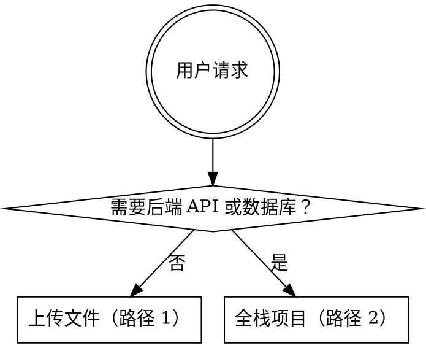
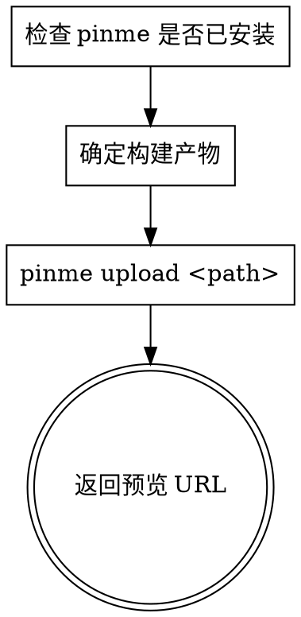
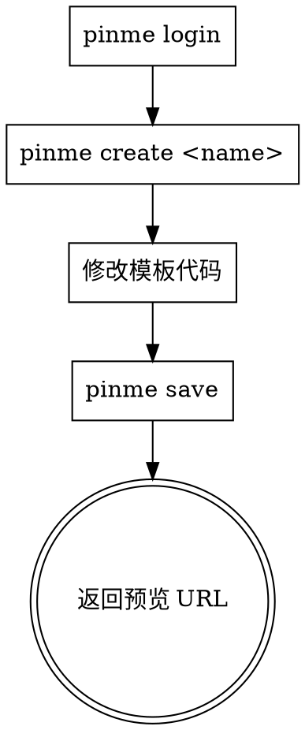

# PinMe

零配置部署工具：将静态文件上传到 IPFS，或创建并部署全栈 Web 项目（React+Vite + Cloudflare Worker + D1 数据库）。Worker 还支持通过 Pinme 平台 API 发送邮件。

## 何时使用



## 路径 1：上传文件 / 静态站点

> 无需登录。



**1. 检查安装：**
```bash
pinme --version
# 如未安装：npm install -g pinme
```

**2. 确定上传目标**（优先级顺序）：
1. `dist/` — Vite / Vue / React
2. `build/` — Create React App
3. `out/` — Next.js 静态导出
4. `public/` — 纯静态文件

**3. 上传：**
```bash
pinme upload <path>
pinme upload ./dist --domain my-site  # 可选：绑定子域名（需 VIP）
```

**4. 返回**预览 URL（`https://pinme.eth.limo/#/preview/*`）给用户。

### 常见示例

```bash
pinme upload ./document.pdf          # 单个文件
pinme upload ./my-folder             # 文件夹
pinme upload dist                    # Vite/Vue 构建产物
pinme upload build                   # CRA 构建产物
pinme upload out                     # Next.js 静态导出
pinme upload ./dist --domain my-site # 绑定 Pinme 子域名（需 VIP）
pinme import ./my-archive.car        # 导入 CAR 文件
```

### 不要上传
- `node_modules/`、`.env`、`.git/`、`src/`
- 只上传构建产物，不要上传源代码

---

## 路径 2：全栈项目

> 需要登录。使用 React+Vite 前端 + Cloudflare Worker 后端 + D1 SQLite 数据库。



### 架构

| 层级 | 技术栈 | 部署目标 |
|------|--------|----------|
| 前端 | React + Vite（`frontend/`） | IPFS |
| 后端 | Cloudflare Worker（`backend/src/worker.ts`） | `{name}.pinme.pro` |
| 数据库 | D1 SQLite（`db/*.sql`） | Cloudflare D1 |

### 核心命令

```bash
pinme login                  # 登录（仅需一次）
pinme create <dirName>       # 克隆模板并创建项目（自动填充 API URL）
pinme save                   # 首次部署 / 完整更新（前端 + 后端 + 数据库，一条命令）
pinme update-worker          # 仅更新后端（当只修改了 backend/src/worker.ts）
pinme update-web             # 仅更新前端（当只修改了 frontend/src/）
pinme update-db              # 仅执行 SQL 迁移（当只修改了 db/）
```

> `pinme save` 会一次性部署前端 + 后端 + 数据库。只有确定仅修改了某一部分时才使用 `pinme update-*`。

### 项目结构

```
{project}/
├── pinme.toml              # 根配置（自动生成，请勿修改）
├── package.json            # Monorepo 根目录（workspaces: frontend + backend）
├── backend/
│   ├── wrangler.toml       # Worker 配置（自动生成，请勿修改）
│   ├── package.json
│   └── src/
│       └── worker.ts       # 后端入口 — 仅提供 JSON API
├── db/
│   └── 001_init.sql        # SQL 表定义
├── frontend/
│   ├── package.json
│   ├── vite.config.ts      # 开发代理：/api → localhost:8787
│   ├── index.html
│   ├── .env                # 自动生成：VITE_WORKER_URL（请勿修改）
│   └── src/
│       ├── main.tsx
│       ├── App.tsx
│       ├── utils/
│       │   └── api.ts      # export const API = import.meta.env.VITE_WORKER_URL || ''
│       └── pages/
│           └── Home/
│               └── index.tsx
└── .gitignore
```

### 首次部署

```bash
pinme login
pinme create my-app
cd my-app
```

`pinme create` 会生成一个可运行的 Hello World 模板（包含前端页面 + 后端 API 路由 + 数据库表结构）。**修改模板**以匹配用户的业务逻辑 — 不要从零开始编写：

- 修改 `backend/src/worker.ts` — 替换 API 路由
- 修改 `frontend/src/pages/` — 替换页面组件
- 修改 `db/001_init.sql` — 替换表定义

```bash
pinme save
# 一条命令部署前端 + 后端 + 数据库
# 输出预览 URL：https://pinme.eth.limo/#/preview/{CID}
```

**返回**预览 URL 给用户。

后端 Worker 部署在 `https://{name}.pinme.pro`。前端 API 请求会自动配置指向该地址 — 无需手动设置。

### 后续更新

| 修改内容 | 命令 | 说明 |
|----------|------|------|
| 仅后端（`backend/src/worker.ts`） | `pinme update-worker` | 更快 |
| 仅前端（`frontend/src/`） | `pinme update-web` | 生成新 CID |
| 仅数据库（`db/`） | `pinme update-db` | 执行新迁移 |
| 多处修改或不确定 | `pinme save` | 安全的完整部署 |

> 每次前端部署会生成新的 CID 和预览 URL。旧 URL 仍可访问。

---

## Worker 代码模式（backend/src/worker.ts）

Worker 后端仅编写 JSON API。**不允许使用 npm 包**（不能用 hono、express 等）。手写路由：

```typescript
export interface Env {
  DB: D1Database;           // 使用数据库时
  API_KEY?: string;         // 使用邮件发送时
  JWT_SECRET: string;       // 使用 JWT 认证时
  ADMIN_PASSWORD: string;   // 使用密码认证时
}

const CORS_HEADERS = {
  'Access-Control-Allow-Origin': '*',
  'Access-Control-Allow-Methods': 'GET, POST, PUT, DELETE, OPTIONS',
  'Access-Control-Allow-Headers': 'Content-Type, Authorization, X-API-Key',
};

function json(data: unknown, status = 200): Response {
  return Response.json(data, { status, headers: CORS_HEADERS });
}

export default {
  async fetch(request: Request, env: Env): Promise<Response> {
    const { pathname } = new URL(request.url);
    const method = request.method;

    if (method === 'OPTIONS') return new Response(null, { status: 204, headers: CORS_HEADERS });

    try {
      if (pathname === '/api/items' && method === 'GET')  return handleGetItems(env);
      if (pathname === '/api/items' && method === 'POST') return handleCreateItem(request, env);
      return json({ error: 'Not found' }, 404);
    } catch {
      return json({ error: 'Internal server error' }, 500);
    }
  },
};
```

### Worker 限制

| 禁止 | 替代方案 |
|------|----------|
| `import from 'hono'` 或任何 npm 包 | 手写路由（`if pathname === '/api/...'`） |
| `import fs from 'fs'` / Node.js 内置模块 | Web API：`crypto`、`fetch`、`URL` 等 |
| `require()` 语法 | 仅使用 ESM `import` |
| Worker 返回 HTML | 仅返回 JSON API |
| 明文存储密码 | 存储前使用 SHA-256 哈希 |
| SQL 字符串拼接 | 使用 `.bind()` 参数化查询 |

### 邮件 API 参考（用于 Worker 后端）

当后端需要邮件发送功能时，使用 Pinme 平台 API（`https://pinme.dev/api/v4/send_email`）。

**1. 配置 API_KEY**

添加到 `Env` 接口：

```typescript
export interface Env {
  DB: D1Database;
  API_KEY?: string;  // 邮件发送必需
}
```

**2. 邮件处理代码**

```typescript
async function handleSendEmail(request: Request, env: Env): Promise<Response> {
  const apiKey = env.API_KEY;
  if (!apiKey) {
    return json({ error: 'API_KEY not configured' }, 500);
  }

  const body = await request.json() as {
    to?: string;
    subject?: string;
    html?: string;
  };

  if (!body.to) return json({ error: 'Email address is required' }, 400);
  if (!body.subject) return json({ error: 'Subject is required' }, 400);
  if (!body.html) return json({ error: 'HTML content is required' }, 400);

  const emailRegex = /^[^\s@]+@[^\s@]+\.[^\s@]+$/;
  if (!emailRegex.test(body.to)) {
    return json({ error: 'Invalid email address' }, 400);
  }

  const response = await fetch('https://pinme.dev/api/v4/send_email', {
    method: 'POST',
    headers: {
      'Content-Type': 'application/json',
      'X-API-Key': apiKey,
    },
    body: JSON.stringify({
      to: body.to,
      subject: body.subject,
      html: body.html,
    }),
  });

  const result = await response.json();
  return json(result);
}
```

## 前端 API 工具（frontend/src/utils/api.ts）

```typescript
// 开发环境：Vite 代理 /api → localhost:8787
// 生产环境：VITE_WORKER_URL 由 pinme create 自动注入
export const API = import.meta.env.VITE_WORKER_URL || '';

export function getApiUrl(path: string): string {
  return API ? `${API}${path}` : path;
}
```

## D1 数据库操作

```typescript
// 查询多行
const { results } = await env.DB.prepare('SELECT * FROM t WHERE x = ?').bind(val).all();

// 查询单行（未找到返回 null）
const row = await env.DB.prepare('SELECT * FROM t WHERE id = ?').bind(id).first();

// 插入并返回新行
const row = await env.DB.prepare('INSERT INTO t (a, b) VALUES (?, ?) RETURNING *').bind(a, b).first();

// 更新
await env.DB.prepare('UPDATE t SET a = ? WHERE id = ?').bind(val, id).run();

// 删除（检查是否命中）
const { meta } = await env.DB.prepare('DELETE FROM t WHERE id = ?').bind(id).run();
if (meta.changes === 0) return json({ error: 'Not found' }, 404);
```

### SQL 迁移文件

**格式：** `db/NNN_description.sql`（例如 `001_init.sql`）。按文件名顺序执行。

**SQLite 类型约束：**

| 不能使用 | 替代方案 |
|----------|----------|
| `BOOLEAN` | `INTEGER`（0 = false，1 = true） |
| `DATETIME` / `TIMESTAMP` | `TEXT`，存储 ISO 8601（默认：`datetime('now')`） |
| `JSON` 类型 | `TEXT`，使用 `JSON.stringify()` / `JSON.parse()` |
| `VARCHAR(n)` | `TEXT` |

## 能力边界

| 限制 | 替代方案 |
|------|----------|
| 文件存储（图片上传） | 存储外部图片 URL，或 `pinme upload` 后存储 IPFS 链接 |
| WebSocket | 轮询 API（每 5 秒 fetch 一次） |
| 多个 Worker | 合并为单个 Worker，使用路由前缀区分 |
| 多个数据库 | 合并为一个 D1 |

## 重要提示

- `pinme.toml`、`backend/wrangler.toml`、`frontend/.env` 为自动生成 — 请勿修改
- 前端 API URL 通过 `VITE_WORKER_URL` 环境变量获取 — 请勿硬编码
- 密码、令牌、API 密钥必须放在 secrets 中，不要写在配置文件里

## 常见错误

| 错误 | 解决方案 |
|------|----------|
| `command not found: pinme` | `npm install -g pinme` |
| `No such file or directory` | 确认路径是否存在 |
| `Permission denied` | 检查文件/文件夹权限 |
| 上传失败 | 检查网络连接，重试 |
| 未登录错误 | 先运行 `pinme login` |

## 其他命令

```bash
pinme list / pinme ls -l 5     # 查看上传历史
pinme list -c                  # 清除上传历史
pinme rm <hash>                # 删除已上传内容
pinme bind <path> --domain <domain>  # 绑定域名（需 VIP + AppKey）
pinme export <CID>             # 导出为 CAR 文件
pinme set-appkey               # 设置/查看 AppKey
pinme my-domains               # 列出已绑定域名
pinme delete <project>          # 删除项目（Worker + 域名 + D1）
pinme logout                   # 退出登录
```