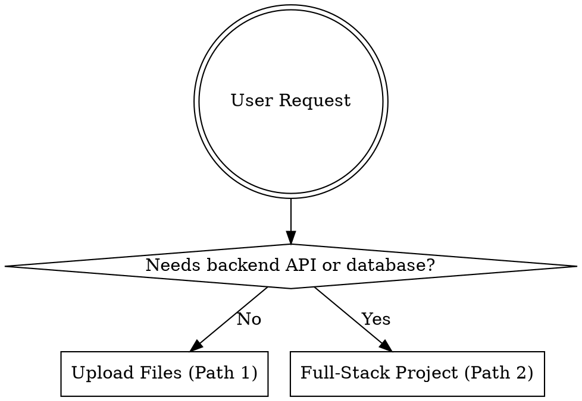
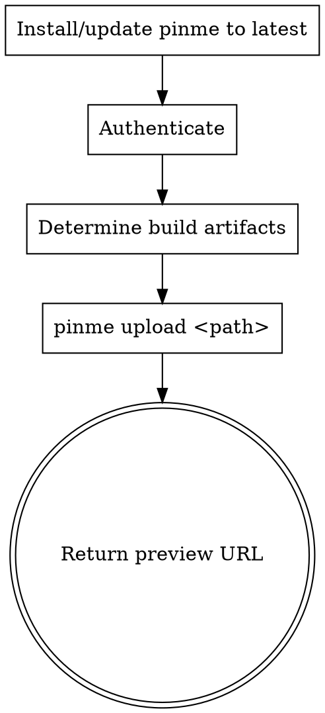
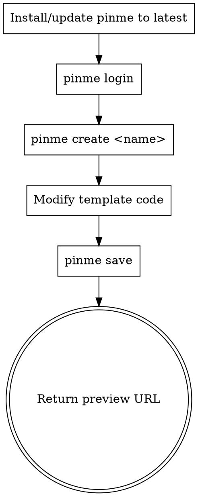

# PinMe

Zero-config deployment tool: upload static files to IPFS, or create and deploy full-stack web projects (React+Vite + Cloudflare Worker + D1 database). Workers also support sending emails via the PinMe platform API.

## When to Use



## Path 1: Upload Files / Static Sites

> Login required. Use `pinme login` or `pinme set-appkey <AppKey>` before `pinme upload` or `pinme import`.



**1. Check installation and update to latest:**
```bash
LOCAL=$(pinme --version 2>/dev/null || echo "0.0.0")
LATEST=$(npm view pinme version)
[ "$LOCAL" != "$LATEST" ] && npm install -g pinme@latest || echo "pinme is up to date ($LOCAL)"
```

**2. Authenticate:**
```bash
pinme login
# or: pinme set-appkey <AppKey>
```

**3. Determine upload target** (priority order):
1. `dist/` — Vite / Vue / React
2. `build/` — Create React App
3. `out/` — Next.js static export
4. `public/` — Plain static files

**4. Upload:**
```bash
pinme upload <path>
pinme upload ./dist --domain my-site  # Optional: bind subdomain (wallet balance required)
```

**5. Return** the final URL printed by PinMe to the user. URL priority is: DNS domain > PinMe subdomain > short URL > preview URL. If it falls back to preview, return the **full URL** including all hash characters — do not truncate.

### Common Examples

```bash
pinme upload ./document.pdf          # Single file
pinme upload ./my-folder             # Folder
pinme upload dist                    # Vite/Vue build artifacts
pinme upload build                   # CRA build artifacts
pinme upload out                     # Next.js static export
pinme upload ./dist --domain my-site # Bind PinMe subdomain (wallet balance required)
pinme import ./my-archive.car        # Import CAR file
```

### Do NOT Upload
- `node_modules/`, `.env`, `.git/`, `src/`
- Only upload build artifacts, never upload source code

---

## Path 2: Full-Stack Project

> Login required. Uses React+Vite frontend + Cloudflare Worker backend + D1 SQLite database.
> When designing frontend projects, use Ant Design as the primary design reference, and prioritize following its conventions for layout, components, spacing, and interaction patterns.



### Architecture

| Layer | Tech Stack | Deploy Target |
|-------|-----------|---------------|
| Frontend | React + Vite (`frontend/`) | IPFS |
| Backend | Cloudflare Worker (`backend/src/worker.ts`) | `{name}.pinme.pro` |
| Database | D1 SQLite (`db/*.sql`) | Cloudflare D1 |

### Core Commands

```bash
pinme login                  # Login (only needed once)
pinme create <dirName>       # Clone template and create project (auto-fills API URL)
pinme save                   # First deploy / full update (frontend + backend + database, single command)
pinme update-worker          # Update backend only (when only backend/src/worker.ts was modified)
pinme update-web             # Update frontend only (when only frontend/src/ was modified)
pinme update-db              # Run SQL migrations only (when only db/ was modified)
```

> `pinme save` deploys frontend + backend + database all at once. Only use `pinme update-*` when you're certain only one part was modified.

### Project Structure

```
{project}/
├── pinme.toml              # Root config (auto-generated, do not modify)
├── package.json            # Monorepo root (workspaces: frontend + backend)
├── backend/
│   ├── wrangler.toml       # Worker config (auto-generated, do not modify)
│   ├── package.json
│   └── src/
│       └── worker.ts       # Backend entry — primarily used for JSON APIs in this template
├── db/
│   └── 001_init.sql        # SQL table definitions
├── frontend/
│   ├── package.json
│   ├── vite.config.ts      # Dev proxy: /api → localhost:8787
│   ├── index.html
│   ├── .env                # Auto-generated: VITE_API_URL (do not modify)
│   └── src/
│       ├── main.tsx
│       ├── App.tsx
│       ├── utils/
│       │   ├── api.ts      # export const API = import.meta.env.VITE_WORKER_URL || ''
│       │   └── config.ts   # Auto-generated: public_client_config (only when auth is enabled)
│       └── pages/
│           └── Home/
│               └── index.tsx
└── .gitignore
```

### First Deployment

```bash
LOCAL=$(pinme --version 2>/dev/null || echo "0.0.0")
LATEST=$(npm view pinme version)
[ "$LOCAL" != "$LATEST" ] && npm install -g pinme@latest
pinme login
pinme create my-app
cd my-app
```

`pinme create` generates a working Hello World template (includes frontend page + backend API routes + database schema). **Modify the template** to match the user's business logic — do not write from scratch:

- Modify `backend/src/worker.ts` — replace API routes
- Modify `frontend/src/pages/` — replace page components
- Modify `db/001_init.sql` — replace table definitions

```bash
pinme save
# Single command deploys frontend + backend + database
# Outputs preview URL: https://pinme.eth.limo/#/preview/{CID}
```

**Return** the preview URL to the user. Note: return the **full URL** including all hash characters — do not truncate.

The backend Worker is deployed at `https://{name}.pinme.pro`. Frontend API requests are automatically configured to point to that address — no manual setup needed.

### Subsequent Updates

| Changes | Command | Notes |
|---------|---------|-------|
| Backend only (`backend/src/worker.ts`) | `pinme update-worker` | Faster |
| Frontend only (`frontend/src/`) | `pinme update-web` | Generates new CID |
| Database only (`db/`) | `pinme update-db` | Runs new migrations |
| Multiple changes or uncertain | `pinme save` | Safe full deployment |

> Each frontend deployment generates a new CID and preview URL. Old URLs remain accessible.

---

## Worker Code Patterns (`backend/src/worker.ts`)

In this template, the Worker backend is primarily used for JSON APIs. Prefer standard Web APIs and simple manual routing by default. Worker-compatible libraries can be added when needed, but the default template does not rely on extra frameworks. Avoid packages that depend on a full Node.js runtime, a persistent local filesystem, native binaries, or child processes.

```typescript
export interface Env {
  DB: D1Database;           // When using database
  API_KEY?: string;         // When using email sending
  JWT_SECRET: string;       // When using JWT auth
  ADMIN_PASSWORD: string;   // When using password auth
}

const CORS_HEADERS = {
  'Access-Control-Allow-Origin': '*',
  'Access-Control-Allow-Methods': 'GET, POST, PUT, DELETE, OPTIONS',
  'Access-Control-Allow-Headers': 'Content-Type, Authorization, X-API-Key',
};

function json(data: unknown, status = 200): Response {
  return Response.json(data, { status, headers: CORS_HEADERS });
}

export default {
  async fetch(request: Request, env: Env): Promise<Response> {
    const { pathname } = new URL(request.url);
    const method = request.method;

    if (method === 'OPTIONS') return new Response(null, { status: 204, headers: CORS_HEADERS });

    try {
      if (pathname === '/api/items' && method === 'GET')  return handleGetItems(env);
      if (pathname === '/api/items' && method === 'POST') return handleCreateItem(request, env);
      return json({ error: 'Not found' }, 404);
    } catch {
      return json({ error: 'Internal server error' }, 500);
    }
  },
};
```

### Worker Constraints and Default Conventions

| Item | Notes |
|------|------|
| Dependency choice | Prefer standard Web APIs and simple manual routing by default. If extra dependencies are needed, prefer Worker-compatible libraries. |
| Node.js capability | Workers now support part of Node.js compatibility, but they are not a full Node.js runtime. Do not assume all Node.js built-in modules are available or behave exactly the same. |
| Filesystem | Do not treat a Worker like a server with a persistent local disk. Even if some `fs` capabilities are available, do not rely on persistence across requests. |
| Response types | This template mainly uses the Worker for JSON APIs. If there is a clear need, it can also be adapted to return HTML or other content. |
| Password storage | Never store passwords in plaintext. Use a dedicated password hashing algorithm such as bcrypt, scrypt, or Argon2. |
| SQL | Do not build SQL by string concatenation. Use parameterized queries such as `.bind()`. |

### Email API Reference (for Worker Backend)

When the backend needs email sending, use the PinMe platform API (`https://pinme.cloud/api/v4/send_email`).

**1. Configure API_KEY**

Add to the `Env` interface:

```typescript
export interface Env {
  DB: D1Database;
  API_KEY?: string;  // Required for email sending
}
```

**2. Email Handler Code**

```typescript
async function handleSendEmail(request: Request, env: Env): Promise<Response> {
  const apiKey = env.API_KEY;
  if (!apiKey) {
    return json({ error: 'API_KEY not configured' }, 500);
  }

  const body = await request.json() as {
    to?: string;
    subject?: string;
    html?: string;
  };

  if (!body.to) return json({ error: 'Email address is required' }, 400);
  if (!body.subject) return json({ error: 'Subject is required' }, 400);
  if (!body.html) return json({ error: 'HTML content is required' }, 400);

  const emailRegex = /^[^\s@]+@[^\s@]+\.[^\s@]+$/;
  if (!emailRegex.test(body.to)) {
    return json({ error: 'Invalid email address' }, 400);
  }

  const response = await fetch('https://pinme.cloud/api/v4/send_email', {
    method: 'POST',
    headers: {
      'Content-Type': 'application/json',
      'X-API-Key': apiKey,
    },
    body: JSON.stringify({
      to: body.to,
      subject: body.subject,
      html: body.html,
    }),
  });

  const result = await response.json();
  return json(result);
}
```

## Frontend API Utility (frontend/src/utils/api.ts)

```typescript
// Development: Vite proxies /api to localhost:8787
// Production: VITE_API_URL is auto-injected by pinme create
export const API = import.meta.env.VITE_API_URL || '';

export function getApiUrl(path: string): string {
  return API ? `${API}${path}` : path;
}
```

## D1 Database Operations

```typescript
// Query multiple rows
const { results } = await env.DB.prepare('SELECT * FROM t WHERE x = ?').bind(val).all();

// Query single row (returns null if not found)
const row = await env.DB.prepare('SELECT * FROM t WHERE id = ?').bind(id).first();

// Insert and return new row
const row = await env.DB.prepare('INSERT INTO t (a, b) VALUES (?, ?) RETURNING *').bind(a, b).first();

// Update
await env.DB.prepare('UPDATE t SET a = ? WHERE id = ?').bind(val, id).run();

// Delete (check if affected)
const { meta } = await env.DB.prepare('DELETE FROM t WHERE id = ?').bind(id).run();
if (meta.changes === 0) return json({ error: 'Not found' }, 404);
```

### SQL Migration Files

**Format:** `db/NNN_description.sql` (for example, `001_init.sql`). Files are executed in filename order.

**SQLite Type Constraints:**

| Do Not Use | Alternative |
|-----------|-------------|
| `BOOLEAN` | `INTEGER` (0 = false, 1 = true) |
| `DATETIME` / `TIMESTAMP` | `TEXT`, stored as ISO 8601 (default: `datetime('now')`) |
| `JSON` type | `TEXT`, using `JSON.stringify()` / `JSON.parse()` |
| `VARCHAR(n)` | `TEXT` |

## Template Architecture Suggestions

| Scenario | Default Suggestion |
|-----------|-------------|
| File storage (image uploads) | Store external image URLs, or upload with `pinme upload` first and then store the resulting link |
| Real-time communication | This template defaults to regular HTTP APIs. If there is no clear real-time requirement, start with polling |
| Multiple Workers | This template defaults to combining functionality into a single Worker and separating routes by prefix |
| Multiple databases | This template defaults to combining data into one D1 database and only splitting when isolation is truly needed |

## Important Notes

- `pinme.toml`, `backend/wrangler.toml`, and `frontend/.env` are generated by PinMe. Do not edit them manually by default. If extra runtime configuration is truly needed, prefer doing it through PinMe-supported mechanisms.
- Obtain the frontend API URL from the `VITE_API_URL` environment variable. Do not hardcode it.
- Passwords, tokens, and API keys must be stored in secrets. Never put them in config files.

## Common Errors

| Error | Solution |
|-------|----------|
| `command not found: pinme` | `npm install -g pinme` |
| `No such file or directory` | Verify that the path exists |
| `Permission denied` | Check file or directory permissions |
| Upload failed | Check the network connection and retry |
| Not logged in | Run `pinme login` first |

## Other Commands

```bash
pinme list / pinme ls -l 5     # View upload history
pinme list -c                  # Clear upload history
pinme rm <hash>                # Delete uploaded content
pinme bind <path> --domain <domain>  # Bind domain (VIP + AppKey required)
pinme export <CID>             # Export as CAR file
pinme set-appkey               # Set/view AppKey
pinme my-domains               # List bound domains
pinme delete <project>          # Delete project (Worker + domain + D1)
pinme logout                   # Log out
```
